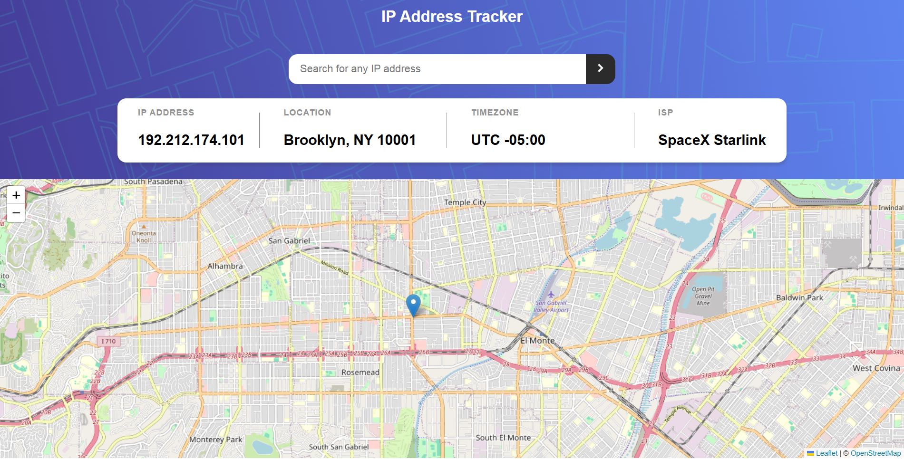

# Frontend Mentor - IP address tracker solution

This is a solution to the [IP address tracker challenge on Frontend Mentor](https://www.frontendmentor.io/challenges/ip-address-tracker-I8-0yYAH0). Frontend Mentor challenges help you improve your coding skills by building realistic projects.

## Table of contents

- [Overview](#overview)
  - [The challenge](#the-challenge)
  - [Screenshot](#screenshot)
  - [Links](#links)
- [My process](#my-process)
  - [Built with](#built-with)
  - [What I learned](#what-i-learned)
- [Acknowledgments](#acknowledgments)

⚠️ **IMPORTANT** ⚠️: To use the IP Geolocation API by IPify, you'll need to sign up for a free account. You won't need to add any cards details to do this and it's a very quick process. This will generate an API Key for you. Usually, you would be able to restrict your API Key to a specific URL (your own domain). This makes sure that other people can't use your API Key on their own websites. IPify doesn't have this feature, but because you aren't adding your card details, this isn't an issue. **So be sure to only sign up for the free account and DO NOT enter any card details**.

For the mapping API, we recommend using [LeafletJS](https://leafletjs.com/). It's free to use and doesn't require an API Key. If you decide to use another API, like Google Maps or Mapbox, be sure to secure your API Key. Here are guides for both Google Maps and Mapbox, be sure to read through them thoroughly:

- [API Key best practices from Google Developers](https://developers.google.com/maps/api-key-best-practices)
- [How to use Mapbox securely](https://docs.mapbox.com/help/troubleshooting/how-to-use-mapbox-securely/)

Exposing your API Key publicly can lead to other people using it to make requests for their own application if the proper precautions aren't in place. Please be sure you read the guides thoroughly and follow their recommendations.

**We don't take any responsibility if you expose your API Key while completing the challenge and have not secured it.**

## Overview

### The challenge

Users should be able to:

- View the optimal layout for each page depending on their device's screen size
- See hover states for all interactive elements on the page
- See their own IP address on the map on the initial page load
- Search for any IP addresses or domains and see the key information and location

### Screenshot

### Links

- Solution URL: [GitHub](https://your-solution-url.com)
- Live Site URL: [Vercel](https://your-live-site-url.com)

## My process

### MY SOLUTION

- first i sign up for an api
- then a map
- build html and style it with css
- finally JavaScript
- I have to figure out how to show user location on the map
- maybe inquire users if they permit location usage
- then figuring out how to access those 4 info: ip, city, time zone and internet service provider(isp)

### Built with

- Semantic HTML5 markup
- CSS custom properties
- Flexbox
- CSS Grid
- Mobile-first workflow
- Map: [LeafletJS](https://leafletjs.com/)
- API: IP Geolocation API by IPify

### What I learned

- Marker is just an optional indicator
- `response.status` show http status code(error) like 200 404 or 401. `response.statusText` is its short discription
- `ok` is a property of response object returned by fetch. it means the request was successful or failed otherwise

## Author

- Website - [Add your name here](https://www.your-site.com)
- Frontend Mentor - [@yourusername](https://www.frontendmentor.io/profile/yourusername)
- Twitter - [@yourusername](https://www.twitter.com/yourusername)

## Acknowledgments

Big thanks to Dave Gray, my YT tutor and a massive thank you to VS Code CoPilot
